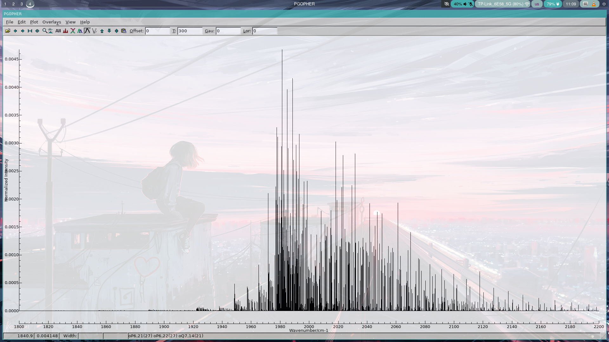

# PGOPHER for NixOS



## About

PGOPHER is a program which is used as simulation & analysis of spectrum. 

PGOPHER with Nix!

based on original page: https://pgopher.chm.bris.ac.uk/ 

## Usage Instructions

### requirements

Needs `nix-ld` config like below:

```nix
programs.nix-ld = {
  enable = true;
  libraries = with pkgs; [
    # X11
    xorg.libX11
    xorg.libXext
    xorg.libXrender
    xorg.libXrandr
    xorg.libXcursor
    xorg.libXcomposite
    xorg.libXtst
    xorg.libXfixes
    xorg.libxcb
    xorg.libXdamage
    xorg.libxshmfence
    xorg.libXxf86vm

    # GTK2
    glib
    gtk2
    gdk-pixbuf

    # others
    zlib
    pango
    atk
    cairo
    stdenv.cc.cc
  ];
};
```

### Running Ad-hoc 

```bash
nix run github:aki-ph-chem/pgopher-nixos/main#pgopher
nix run github:aki-ph-chem/pgopher-nixos/main#pgo
nix run github:aki-ph-chem/pgopher-nixos/main#tabslave
```

### Intalling the applications on your system (Optional)

#### Intall sith nix-profile

#### Intall on NixOS/Home Manager
