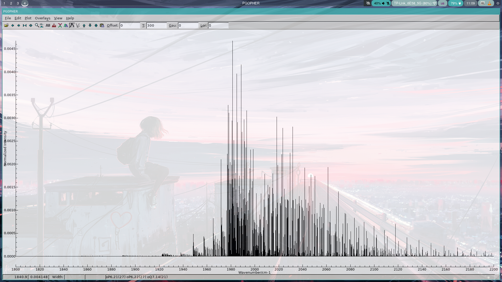

# PGOPHER for NixOS



## About

PGOPHER with Nix!

PGOPHER is a program which is used as simulation & analysis of spectrum. 

This package is based on original [PGOPHER](https://pgopher.chm.bris.ac.uk/) 
and wrap executable binary with flake.

## Applied patches

The upstream PGOPHER binaries are prebuilt with Free Pascal (fpc 3.3.1, 2018).
At startup the FPC runtime initializes the timezone by reading `/etc/timezone`
(a plain-text zone-name file). Modern NixOS does not provide `/etc/timezone` as
a regular file, and the failed read causes a nil dereference in the FPC RTL —
the binary dies with **SIGSEGV (runtime error 216)** before any argument is
processed. This affects every user of this flake on NixOS, not a specific
machine.

To work around this, the build applies a same-length patch to `pgo`, `pgopher`,
and `tabslave`, replacing the string `/etc/timezone` with `/tmp/timezone`, and
wraps each binary so that `/tmp/timezone` exists at runtime. The wrapper derives
the zone name from `/etc/localtime` on first run (falling back to `UTC`), so no
locale is hardcoded. The actual timezone is still resolved by the program via
`/etc/localtime`, so the file content only needs to be a well-formed zone name.
This resolution happens at runtime rather than build time because the NixOS build
sandbox has no timezone information (`TZ=UTC`, no `/etc/localtime`). The patch
has a build-time self-check that fails if the string disappears in a future
upstream tarball (so a silently unpatched, crashing binary is never shipped).

See [issue #5](https://github.com/aki-ph-chem/pgopher-nixos/issues/5) for the
full investigation.

## Usage Instructions

### requirements

Needs `nix-ld` config like below:

```nix
programs.nix-ld = {
  enable = true;
  libraries = with pkgs; [
    # X11
    xorg.libX11
    xorg.libXext
    xorg.libXrender
    xorg.libXrandr
    xorg.libXcursor
    xorg.libXcomposite
    xorg.libXtst
    xorg.libXfixes
    xorg.libxcb
    xorg.libXdamage
    xorg.libxshmfence
    xorg.libXxf86vm

    # GTK2
    glib
    gtk2
    gdk-pixbuf

    # others
    zlib
    pango
    atk
    cairo
    stdenv.cc.cc
  ];
};
```

### Running Ad-hoc 

```bash
nix run github:aki-ph-chem/pgopher-nixos/main#pgopher
nix run github:aki-ph-chem/pgopher-nixos/main#pgo
nix run github:aki-ph-chem/pgopher-nixos/main#tabslave
```

### Intall on NixOS/Home Manager

<details>
<summary>Install on NixOS</summary>

```nix
{
  inputs = {
    # ...
    pgopher = {
      url = "github:aki-ph-chem/pgopher-nixos?ref=fix/desktop-entroy";
      inputs.nixpkgs.follows = "nixpkgs";
    };
  };


  outputs = inputs @ {
    pgopher
    ...
  }: {
    nixosConfigurations.my-system = nixpkgs.lib.nixosSystem {
      system = "x86_64-linux";
      specialArgs = {inherit inputs;};
      modules = [
        # ...
        {
          environment.systemPackages = [pgopher.packages.x86_64-linux.default];
        }
      ];
    };
  }
}
```

</details>

<details>
<summary>Install with Home Manager</summary>

```nix
{
  inputs = {
    pgopher = {
      url = "github:aki-ph-chem/pgopher-nixos?ref=fix/desktop-entroy";
      inputs.nixpkgs.follows = "nixpkgs";
    };
    # ...
  };

  outputs = inputs @ {
    pgopher
    ...
  }: {
    homeConfigurations.my-user = home-manager.lib.homeManagerConfiguration {
      pkgs = nixpkgs.legacyPackages."x86_64-linux";
      extraSpecialArgs = {inherit inputs;};
      modules = [
        # ...
        {
          home.packages = [pgopher.packages.x86_64-linux.default];
        }
      ];
    };
  }
}
```

</details>
